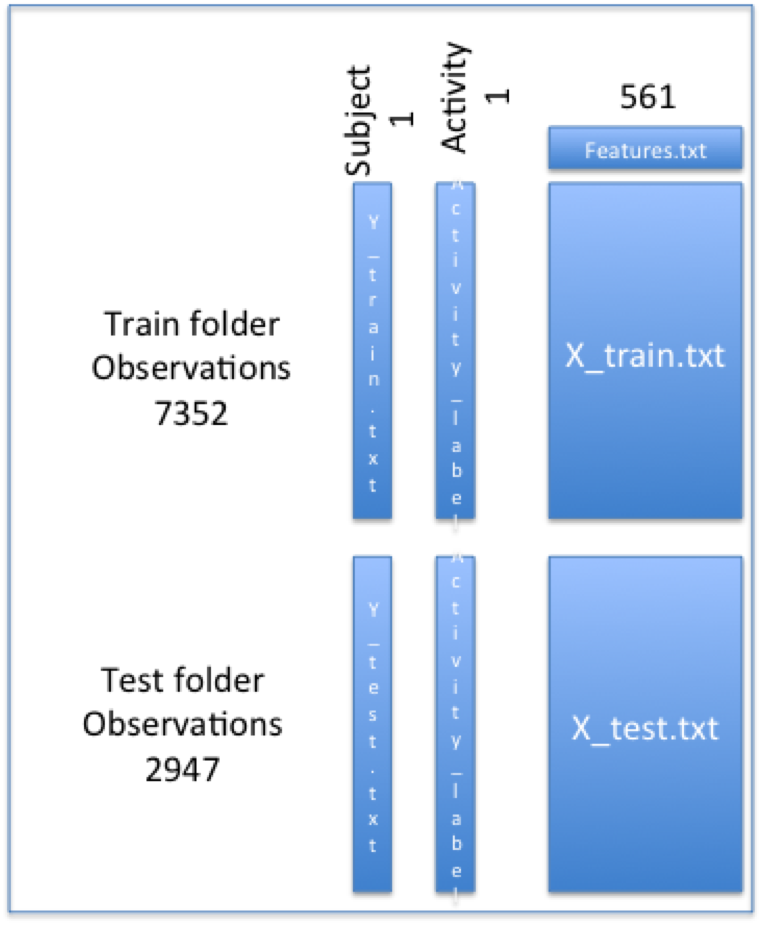

# Getting-and-Cleaning-final-assignment
the final assignment with a script to edit the Human Activity Recognition Using Smartphones Data Set and make it tidy

Welcome to the final assignment for Getting and Cleaning Data class

I created a script called run_analysis.R that does the following:

It assumes that the user has downloaded the Human Activity Recognition Using Smartphones Data Set from the UCI Machine Learning Repository and stored on the working directory - in a folder called UCI HAR Dataset

There are many files in the data set, but we're using the training and the test data sets, which are text files with an "X_" title .  the variable names are stored in additional text files with a "y_" title.  
Merges the training and the test sets to create one data set.
Here's a graphic of how I chose to connect the data sets to make one large dataset.
 we end up with a 10299 x 563 data frame

the script uses cbind and rbind to merge the files correctly

The next step is to extracts only the measurements on the mean and standard deviation for each measurement.
the script uses grep to get a logical indicating the names with the mean and std names and then uses it as an index, creating a smaller dataset with only 88 columns

Next the script replaces the integers in the activity column with descriptive activity names as defined by the activity data set - here I got the job done using 
ifelse() rather than some more powerful tool from R

In order to appropriately label the data set with descriptive variable names - I used the guidance from class: the names should be lowercase, descriptive and not duplicate, with no underscores, dots or white space, characters should be factors 
 
therefore the names were made lower case characters 
and I removing all punctuation - in order to use the columname neatly with dplyr

Finally, the instructions require the creation of a second, independent tidy data set with the average of each variable for each activity and each subject.

this means 6 x 30 groups of subject-activity 180 vs. 86 measurment averages
I used the dplyr library's tools to accomplish this.

At the end of the script, it writes the table to a file called tidyset.txt
